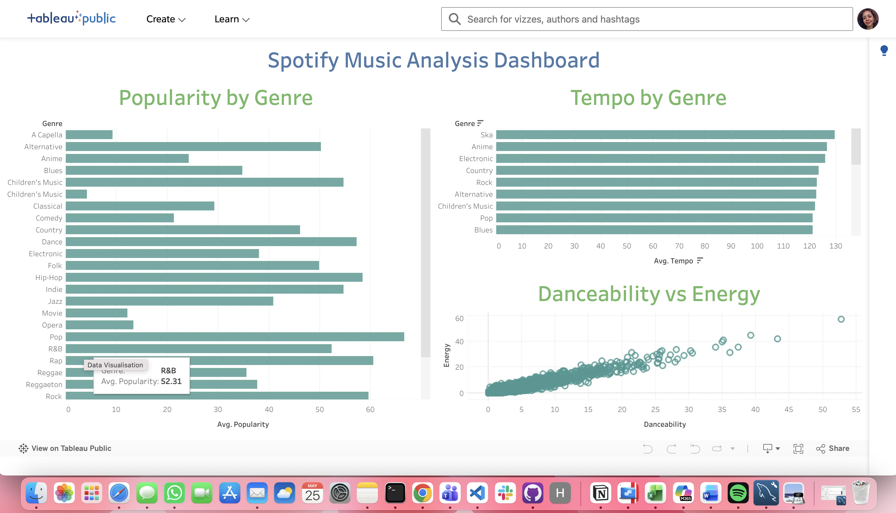

# Spotify Music Dashboard

Tableau dashboard exploring Spotify music trends and audio features.

## Project Objective

Analyse relationships between popularity, energy, tempo and genre patterns to identify music trends and listening behaviour.

## Tools Used

🎵 Tableau Public  
📊 Data visualisation  
📈 KPI analysis  

## Key Questions

- Which songs have the highest popularity?
- How does energy vary across tracks?
- Is there a relationship between tempo and popularity?
- Which genres show different audio characteristics?

## Dashboard Features

- Interactive dashboard
- KPI cards
- Popularity analysis
- Audio feature exploration
- Trend visualisations

## Key Insights

- Popularity varies significantly across tracks.
- Energy and tempo patterns differ between songs.
- Audio features provide insights into music behaviour.

## Skills Demonstrated

- Dashboard design
- Data storytelling
- Tableau
- Data visualisation
- KPI analysis

## Tableau Public

https://public.tableau.com/app/profile/gabriela.lins/vizzes

